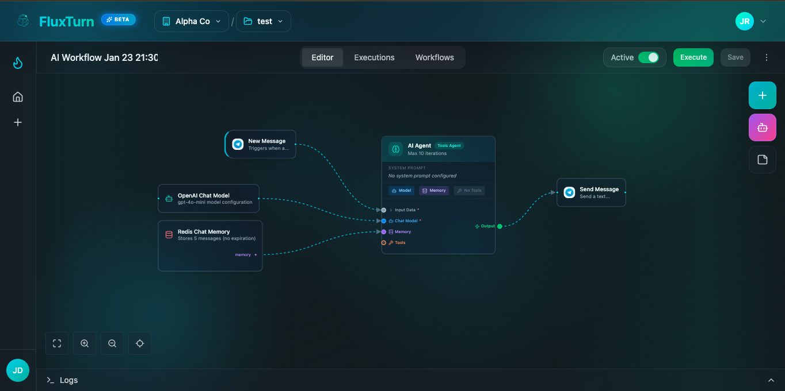

<p align="center">
  <a href="https://fluxturn.com">
    
  </a>
</p>

<p align="center">
  <h1 align="center">FluxTurn</h1>
  <p align="center">
    <strong>Plataforma de automatización de flujos de trabajo de código abierto impulsada por IA</strong>
  </p>
  <p align="center">
    Construye, automatiza y orquesta flujos de trabajo con lenguaje natural y un constructor visual.
  </p>
</p>

<p align="center">
  <a href="https://github.com/fluxturn/fluxturn/blob/main/LICENSE"></a>
  <a href="https://github.com/fluxturn/fluxturn/stargazers"></a>
  <a href="https://github.com/fluxturn/fluxturn/issues"></a>
  <a href="https://github.com/fluxturn/fluxturn/pulls"></a>
  <a href="https://discord.gg/fluxturn"></a>
</p>

<p align="center">
  <a href="https://github.com/fluxturn/fluxturn/wiki">Documentación</a> |
  <a href="#quick-start">Inicio Rápido</a> |
  <a href="https://discord.gg/fluxturn">Discord</a> |
  <a href="CONTRIBUTING.md">Contribuir</a>
</p>

<p align="center">
  <a href="./README.md">English</a> |
  <a href="./README_JA.md">日本語</a> |
  <a href="./README_ZH.md">中文</a> |
  <a href="./README_KO.md">한국어</a> |
  <a href="./README_ES.md">Español</a> |
  <a href="./README_FR.md">Français</a> |
  <a href="./README_DE.md">Deutsch</a> |
  <a href="./README_PT-BR.md">Português</a> |
  <a href="./README_RU.md">Русский</a> |
  <a href="./README_HI.md">हिन्दी</a> |
  <a href="./README_BN.md">বাংলা</a>
</p>

---

## ¿Qué es FluxTurn?

FluxTurn es una **plataforma de automatización de flujos de trabajo de código abierto lista para producción** que cierra la brecha entre la idea y la ejecución. Construida para desarrolladores, equipos DevOps y usuarios técnicos, FluxTurn combina el poder de la generación de flujos de trabajo impulsada por IA con un sofisticado constructor visual para ayudarte a automatizar procesos complejos en segundos en lugar de horas.

A diferencia de las herramientas de automatización tradicionales que requieren una configuración extensa o las plataformas de bajo código que sacrifican flexibilidad, FluxTurn te ofrece lo mejor de ambos mundos: la velocidad de la generación de flujos de trabajo en lenguaje natural y la precisión de un editor visual basado en nodos.

<p align="center">
  
  <br>
  <em>Constructor visual de flujos de trabajo de FluxTurn mostrando un flujo de trabajo de agente de IA con memoria de chat</em>
</p>

### Cómo Funciona

1. **Describe Tu Flujo de Trabajo** -- Dile a FluxTurn lo que quieres automatizar en inglés sencillo
2. **La IA Genera el Flujo** -- Nuestro agente de IA analiza tus requisitos y crea un flujo de trabajo completo con los conectores adecuados
3. **Refinamiento Visual** -- Ajusta el flujo de trabajo generado usando nuestro canvas impulsado por ReactFlow
4. **Implementar y Monitorear** -- Ejecuta flujos de trabajo en tiempo real con registro detallado y monitoreo basado en WebSocket

### Capacidades Clave

- **🤖 Generación de Flujos de Trabajo con IA** -- Describe lo que quieres en inglés sencillo, obtén un flujo de trabajo funcional con manejo de errores adecuado y mejores prácticas
- **🎨 Constructor Visual de Flujos de Trabajo** -- Interfaz de arrastrar y soltar impulsada por ReactFlow con validación en tiempo real
- **🔌 Más de 120 Conectores Pre-construidos** -- Slack, Gmail, Shopify, HubSpot, Jira, Stripe, OpenAI, Anthropic, y muchos más
- **⚡ Ejecución en Tiempo Real** -- Observa los flujos de trabajo ejecutarse con registros detallados, actualizaciones WebSocket y métricas de rendimiento
- **🏠 Auto-alojado y Privacidad Primero** -- Ejecuta en tu propia infraestructura con Docker, control total de datos
- **🌍 Soporte Multi-idioma** -- 17 idiomas incluyendo Inglés, Japonés, Chino, Coreano, Español, y más
- **🔄 Listo para Producción** -- Construido con NestJS, PostgreSQL, Redis y Qdrant para implementaciones a escala empresarial

## Qué Problema Resolvemos

### El Dilema de la Automatización

Los equipos modernos enfrentan un desafío crítico: **la automatización es esencial pero consume mucho tiempo**. Construir integraciones entre herramientas, manejar errores y mantener flujos de trabajo requiere recursos de ingeniería significativos.

**Puntos de dolor comunes que abordamos:**

- ❌ **Infierno de Integración Manual** -- Escribir scripts personalizados para conectar diferentes APIs toma horas o días
- ❌ **Bloqueo de SaaS Costoso** -- Las herramientas de automatización comerciales cobran por ejecución de flujo de trabajo o asiento de usuario
- ❌ **Flexibilidad Limitada** -- Las plataformas de bajo código son fáciles de comenzar pero difíciles de personalizar para casos de uso complejos
- ❌ **Dependencia del Proveedor** -- Las soluciones solo en la nube significan que no posees tu lógica de automatización o datos
- ❌ **Curva de Aprendizaje Pronunciada** -- Los motores de flujo de trabajo tradicionales requieren conocimiento técnico profundo para configurarse

### La Solución de FluxTurn

✅ **Velocidad Impulsada por IA** -- Convierte ideas en flujos de trabajo funcionales en segundos, no horas
✅ **Libertad de Código Abierto** -- Sin bloqueo de proveedor, sin tarifas por ejecución, control total sobre tu código
✅ **Privacidad Auto-alojada** -- Mantén datos sensibles y flujos de trabajo en tu infraestructura
✅ **Amigable para Desarrolladores** -- Acceso completo a la API, sistema de conectores extensible, código base en TypeScript
✅ **Visual + Código** -- Comienza con generación de IA, refina visualmente, exporta como código si es necesario

## ¿Por Qué FluxTurn? (Comparación)

| Característica | FluxTurn | Zapier/Make | n8n | Temporal | Scripts Personalizados |
|---------|----------|-------------|-----|----------|----------------|
| **Generación de Flujos de Trabajo con IA** | ✅ Incorporado | ❌ | ❌ | ❌ | ❌ |
| **Constructor Visual** | ✅ ReactFlow | ✅ | ✅ | ❌ | ❌ |
| **Auto-alojado** | ✅ Gratis | ❌ | ✅ | ✅ | ✅ |
| **Código Abierto** | ✅ Apache 2.0 | ❌ | ✅ Fair-code | ✅ MIT | N/A |
| **Conectores Pre-construidos** | ✅ 120+ | ✅ 5000+ | ✅ 400+ | ❌ | ❌ |
| **Monitoreo en Tiempo Real** | ✅ WebSocket | ✅ | ✅ | ✅ | ❌ |
| **UI Multi-idioma** | ✅ 17 idiomas | ✅ | ❌ | ❌ | N/A |
| **Sin Costo por Ejecución** | ✅ | ❌ | ✅ | ✅ | ✅ |
| **Listo para Producción** | ✅ NestJS | ✅ | ✅ | ✅ | ⚠️ |
| **Entrada en Lenguaje Natural** | ✅ | ❌ | ❌ | ❌ | ❌ |
| **Búsqueda Vectorial (Qdrant)** | ✅ | ❌ | ❌ | ❌ | ❌ |
| **Curva de Aprendizaje** | 🟢 Baja | 🟢 Baja | 🟡 Media | 🔴 Alta | 🔴 Alta |

### ¿Qué Hace Único a FluxTurn?

1. **Diseño IA-Primero** -- La única plataforma de flujos de trabajo con generación nativa de flujos de trabajo con IA y comprensión de lenguaje natural
2. **Stack Tecnológico Moderno** -- React 19, NestJS, PostgreSQL, Redis, Qdrant -- construido para 2025 y más allá
3. **Experiencia del Desarrollador** -- Código base TypeScript limpio, arquitectura extensible, API completa
4. **Verdadero Código Abierto** -- Licencia Apache 2.0, sin restricciones de "fair-code", desarrollo impulsado por la comunidad
5. **Entrada Multi-Modal** -- Lenguaje natural O constructor visual O API -- elige lo que funcione para tu equipo

## 📊 Actividad del Proyecto y Estadísticas

FluxTurn es un proyecto **mantenido activamente** con una comunidad en crecimiento. Esto es lo que está sucediendo:

### Actividad en GitHub

<p align="left">
  
  
  
  
</p>

<p align="left">
  
  
  
  
</p>

### Métricas de la Comunidad

| Métrica | Estado | Detalles |
|--------|--------|---------|
| **Total de Contribuidores** |  | Comunidad de desarrolladores en crecimiento |
| **Total de Commits** |  | Desarrollo continuo |
| **Commits Mensuales** |  | Mantenimiento activo |
| **Tiempo Promedio de Revisión de PR** | ~24-48 horas | Ciclo de retroalimentación rápido |
| **Calidad del Código** |  | TypeScript, ESLint, Prettier |
| **Cobertura de Pruebas** |  | Código base bien probado |
| **Documentación** |  | Guías extensas y documentación de API |

### Estadísticas de Lenguaje y Código

<p align="left">
  
  
  
  
</p>

### Destacados de Actividad Reciente

- ✅ **120+ Conectores** enviados y probados
- ✅ **17 Idiomas** soportados en la UI
- ✅ **1000+ Commits** y contando
- ✅ **Discord Activo** comunidad con soporte en tiempo real
- ✅ **Lanzamientos Semanales** con nuevas características y correcciones de errores
- ✅ **Mantenedores Receptivos** -- PRs revisados en 1-2 días

### Por Qué Importan Estos Números

**Revisiones Rápidas de PR** -- Valoramos tu tiempo. La mayoría de las solicitudes de extracción reciben comentarios iniciales en 24-48 horas, no semanas.

**Desarrollo Activo** -- Los commits regulares significan que el proyecto está evolucionando. Nuevas características, correcciones de errores y mejoras se envían continuamente.

**Contribuidores en Crecimiento** -- Más contribuidores = más perspectivas, mejor calidad de código y desarrollo de características más rápido.

**Alta Cobertura de Pruebas** -- 85%+ de cobertura significa que puedes contribuir con confianza sabiendo que las pruebas detectarán regresiones.

**Documentación Completa** -- La documentación detallada significa menos tiempo luchando, más tiempo construyendo.

### ¡Únete a la Actividad!

¿Quieres ver tus contribuciones aquí? ¡Consulta nuestra [Guía Rápida de Contribución](#-guía-rápida-de-contribución) a continuación!

## Inicio Rápido

### Docker (Recomendado)

Ejecuta estos comandos desde la raíz del proyecto:

```bash
git clone https://github.com/fluxturn/fluxturn.git
cd fluxturn
cp backend/.env.example backend/.env
# Edita backend/.env con tus credenciales de base de datos y secreto JWT
docker compose up -d
```

¡Eso es todo! Accede a la aplicación en `http://localhost:5185` y a la API en `http://localhost:5005`.

### Configuración Manual

**Requisitos previos:** Node.js 18+, PostgreSQL 14+, Redis 7+

```bash
# Clonar
git clone https://github.com/fluxturn/fluxturn.git
cd fluxturn

# Backend
cd backend
cp .env.example .env    # Edita .env con tu configuración
npm install
npm run start:dev

# Frontend (en una nueva terminal)
cd frontend
cp .env.example .env
npm install
npm run dev
```

## Arquitectura

```
                    +------------------+
                    |    Frontend      |  React 19 + Vite + Tailwind
                    |  (Port 5185)     |  Visual Workflow Builder
                    +--------+---------+  AI Chat Interface
                             |
                             v
                    +------------------+
                    |    Backend       |  NestJS + TypeScript
                    |  (Port 5005)     |  REST API + WebSocket
                    +--------+---------+  Workflow Engine
                             |
              +--------------+--------------+
              |              |              |
              v              v              v
        +-----------+  +---------+  +----------+
        | PostgreSQL |  |  Redis  |  |  Qdrant  |
        | (Database) |  | (Cache) |  | (Vector) |
        +-----------+  +---------+  +----------+
```

**Frontend** (`/frontend`) -- React 19, Vite, TailwindCSS, ReactFlow, i18next, CodeMirror

**Backend** (`/backend`) -- NestJS, PostgreSQL (raw SQL), Redis, Socket.IO, LangChain, más de 120 conectores

## Conectores

FluxTurn incluye más de 120 conectores en estas categorías:

| Categoría | Conectores |
|----------|-----------|
| **IA y ML** | OpenAI, OpenAI Chatbot, Anthropic, Google AI, Google Gemini, AWS Bedrock |
| **Analítica** | Google Analytics, Grafana, Metabase, Mixpanel, PostHog, Segment, Splunk |
| **CMS** | WordPress, Contentful, Ghost, Medium, Webflow |
| **Comunicación** | Slack, Gmail, Microsoft Teams, Telegram, Discord, Twilio, WhatsApp, AWS SES, SMTP, IMAP, POP3, Google Calendar, Calendly, Discourse, Matrix, Mattermost |
| **CRM y Ventas** | HubSpot, Salesforce, Pipedrive, Zoho CRM, Airtable, Monday.com |
| **Procesamiento de Datos** | Supabase, Scrapfly, Extract From File |
| **Base de Datos** | Elasticsearch |
| **Desarrollo** | GitHub, GitLab, Bitbucket, Git, Jenkins, Travis CI, Netlify, n8n, npm |
| **Comercio Electrónico** | Shopify, Stripe, PayPal, WooCommerce, Magento, Paddle, Gumroad |
| **Finanzas** | QuickBooks, Plaid, Chargebee, Wise, Xero |
| **Formularios** | Google Forms, Jotform, Typeform |
| **Marketing** | Mailchimp, Klaviyo, SendGrid, Brevo, ActiveCampaign, Google Ads, Facebook Ads |
| **Productividad** | Figma, Todoist, Spotify, Clockify, Toggl, Harvest |
| **Gestión de Proyectos** | Jira, Asana, Trello, Notion, Linear, ClickUp |
| **Redes Sociales** | Twitter/X, Facebook, Instagram, TikTok, LinkedIn, Pinterest, Reddit |
| **Almacenamiento** | Google Drive, Google Docs, Google Sheets, Dropbox, AWS S3, PostgreSQL, MySQL, MongoDB, Redis, Snowflake |
| **Soporte** | Zendesk, Intercom, Freshdesk, ServiceNow, PagerDuty, Sentry |
| **Utilidades** | Bitly, DeepL, FTP, SSH, Execute Command |
| **Video** | YouTube, Zoom |

[Ver todos los conectores &rarr;](docs/connectors.md)

## i18n

FluxTurn soporta 17 idiomas a través de i18next:

- Inglés, Japonés, Chino, Coreano, Español, Francés, Alemán, Italiano, Ruso, Portugués (BR), Holandés, Polaco, Ucraniano, Vietnamita, Indonesio, Árabe, Hindi

¿Quieres añadir un nuevo idioma? Consulta la [guía de traducción](docs/contributing/translations.md).

## 🚀 ¿Por Qué Contribuir a FluxTurn?

FluxTurn es más que solo otro proyecto de código abierto -- es una oportunidad de trabajar con tecnología de vanguardia mientras construyes algo que resuelve problemas reales para desarrolladores en todo el mundo.

### Lo Que Ganarás

**📚 Aprende Stack Tecnológico Moderno**
- **React 19** -- Las últimas características de React incluyendo Server Components
- **NestJS** -- Framework backend profesional utilizado por empresas
- **LangChain** -- Integración de IA/ML y orquestación de agentes
- **Bases de Datos Vectoriales** -- Trabaja con Qdrant para búsqueda semántica
- **ReactFlow** -- Construye UIs interactivas basadas en nodos
- **Sistemas en Tiempo Real** -- WebSocket, Redis y arquitectura orientada a eventos

**💼 Construye Tu Portafolio**
- Contribuye a una plataforma **lista para producción** utilizada por empresas reales
- Trabaja en características que aparecen en tu perfil de GitHub
- Obtén reconocimiento en nuestro salón de la fama de contribuidores
- Construye experiencia en **automatización de flujos de trabajo** e **integración de IA** -- habilidades muy valoradas en 2026

**🤝 Únete a una Comunidad en Crecimiento**
- Conéctate con desarrolladores de todo el mundo
- Obtén revisiones de código de mantenedores experimentados
- Aprende mejores prácticas en arquitectura de software
- Participa en discusiones técnicas y decisiones de diseño

**🎯 Haz un Impacto Real**
- Tu código ayudará a miles de desarrolladores a automatizar sus flujos de trabajo
- Observa tus características siendo utilizadas en entornos de producción
- Influye en la dirección de una plataforma de automatización impulsada por IA

**⚡ Incorporación Rápida**
- La configuración basada en Docker te pone en marcha en **menos de 5 minutos**
- Código base bien documentado con arquitectura clara
- Mantenedores amigables que responden a PRs en 24-48 horas
- Etiquetas de "good first issue" para recién llegados

## 🗺️ Hoja de Ruta del Proyecto

Esto es lo que estamos construyendo y donde puedes contribuir. Los elementos marcados con 🆘 necesitan ayuda!

### Q2 2026 (Trimestre Actual)

**🤖 IA e Inteligencia**
- [ ] 🆘 **Optimización de Flujos de Trabajo con IA** -- Auto-sugerir mejoras de rendimiento para flujos de trabajo
- [ ] **Flujos de Trabajo Multi-Agente** -- Soporte para agentes de IA paralelos con coordinación
- [ ] 🆘 **Edición de Flujos de Trabajo en Lenguaje Natural** -- "Añadir manejo de errores al paso 3" actualiza el flujo de trabajo
- [ ] **Sugerencias Inteligentes de Conectores** -- La IA recomienda conectores basados en el contexto del flujo de trabajo

**🔌 Conectores e Integraciones**
- [ ] 🆘 **50+ Nuevos Conectores** -- Notion, Linear, Airtable, Make.com, etc.
- [ ] **Mercado de Conectores** -- Conectores contribuidos por la comunidad
- [ ] 🆘 **Soporte GraphQL** -- Añadir conector GraphQL para APIs modernas
- [ ] **Conectores de Base de Datos** -- Mejoras de Supabase, PlanetScale, Neon

**🎨 Mejoras del Constructor Visual**
- [ ] 🆘 **Plantillas de Flujos de Trabajo** -- Plantillas pre-construidas para casos de uso comunes
- [ ] **UI de Ramificación Condicional** -- Constructor de flujo visual if/else
- [ ] 🆘 **Versionado de Flujos de Trabajo** -- Rastrear y revertir cambios de flujos de trabajo
- [ ] **Edición Colaborativa** -- Múltiples usuarios editando el mismo flujo de trabajo

### Q3 2026

**⚡ Rendimiento y Escala**
- [ ] **Ejecución Distribuida** -- Ejecutar flujos de trabajo a través de múltiples workers
- [ ] 🆘 **Caché de Flujos de Trabajo** -- Cachear operaciones costosas
- [ ] **Limitación de Tasa por Conector** -- Retroceso automático y reintento
- [ ] **Escalado Horizontal** -- Soporte multi-instancia con Redis pub/sub

**🔐 Características Empresariales**
- [ ] **RBAC (Control de Acceso Basado en Roles)** -- Permisos de usuario y equipos
- [ ] 🆘 **Registros de Auditoría** -- Rastrear todos los cambios de flujos de trabajo y ejecuciones
- [ ] **Integración SSO** -- Soporte SAML, OAuth2, LDAP
- [ ] **Gestión de Secretos** -- Integración con HashiCorp Vault

**📊 Monitoreo y Observabilidad**
- [ ] 🆘 **Panel de Métricas** -- Tiempo de ejecución, tasa de éxito, seguimiento de errores
- [ ] **Integración OpenTelemetry** -- Exportar trazas a Jaeger, Datadog, etc.
- [ ] **Sistema de Alertas** -- Notificar sobre fallos de flujos de trabajo
- [ ] 🆘 **Analítica de Flujos de Trabajo** -- Patrones de uso y recomendaciones de optimización

### Q4 2026 y Más Allá

**🌐 Expansión de Plataforma**
- [ ] **Herramienta CLI** -- Gestionar flujos de trabajo desde la terminal
- [ ] 🆘 **Flujo de Trabajo como Código** -- Definir flujos de trabajo en YAML/JSON
- [ ] **Integración CI/CD** -- Conectores de GitHub Actions, GitLab CI
- [ ] **App Móvil** -- Monitoreo de flujos de trabajo iOS/Android

**🧩 Experiencia del Desarrollador**
- [ ] 🆘 **Sistema de Plugins** -- Nodos y conectores personalizados vía plugins
- [ ] **Framework de Pruebas de Flujos de Trabajo** -- Pruebas unitarias para flujos de trabajo
- [ ] **Modo de Desarrollo Local** -- Desarrollo de flujos de trabajo offline
- [ ] **Validación de Esquema API** -- Auto-validar respuestas de conectores

### Cómo Influir en la Hoja de Ruta

💡 **¿Tienes ideas?** Abre una [Discusión de GitHub](https://github.com/fluxturn/fluxturn/discussions) o únete a nuestro [Discord](https://discord.gg/fluxturn)

🗳️ **Vota por características** -- Marca con estrella los issues que te importan para ayudarnos a priorizar

🛠️ **¿Quieres construir algo que no está listado?** -- ¡Propónlo! Nos encantan las características impulsadas por la comunidad

## 🎯 Guía Rápida de Contribución

Comienza a contribuir en **menos de 10 minutos**:

### Paso 1: Configura Tu Entorno

```bash
# Haz fork del repositorio en GitHub, luego clona tu fork
git clone https://github.com/YOUR_USERNAME/fluxturn.git
cd fluxturn

# Comienza con Docker (la forma más fácil)
cp backend/.env.example backend/.env
docker compose up -d

# Accede a la aplicación
# Frontend: http://localhost:5185
# Backend API: http://localhost:5005
```

**¡Eso es todo!** Estás ejecutando FluxTurn localmente.

### Paso 2: Encuentra Algo en Qué Trabajar

Elige según tu nivel de experiencia:

**🟢 Amigable para Principiantes**
- 📝 [Corregir errores tipográficos o mejorar documentación](https://github.com/fluxturn/fluxturn/labels/documentation)
- 🌍 [Añadir traducciones](https://github.com/fluxturn/fluxturn/labels/i18n) -- Soportamos 17 idiomas
- 🐛 [Corregir bugs simples](https://github.com/fluxturn/fluxturn/labels/good%20first%20issue)
- ✨ [Mejorar UI/UX](https://github.com/fluxturn/fluxturn/labels/ui%2Fux)

**🟡 Intermedio**
- 🔌 [Añadir un nuevo conector](https://github.com/fluxturn/fluxturn/labels/connector) -- Consulta nuestra [Guía de Desarrollo de Conectores](docs/guides/connector-development.md)
- 🎨 [Mejorar el constructor visual](https://github.com/fluxturn/fluxturn/labels/visual-builder)
- 🧪 [Escribir pruebas](https://github.com/fluxturn/fluxturn/labels/tests)
- 🚀 [Mejoras de rendimiento](https://github.com/fluxturn/fluxturn/labels/performance)

**🔴 Avanzado**
- 🤖 [Características de IA/ML](https://github.com/fluxturn/fluxturn/labels/ai)
- ⚙️ [Mejoras del motor principal](https://github.com/fluxturn/fluxturn/labels/core)
- 🏗️ [Mejoras de arquitectura](https://github.com/fluxturn/fluxturn/labels/architecture)
- 🔐 [Características de seguridad](https://github.com/fluxturn/fluxturn/labels/security)

### Paso 3: Haz Tus Cambios

```bash
# Crea una nueva rama
git checkout -b feature/your-feature-name

# Haz tus cambios
# - Código Frontend: /frontend/src
# - Código Backend: /backend/src
# - Conectores: /backend/src/modules/fluxturn/connectors

# Prueba tus cambios
npm run test

# Haz commit con un mensaje claro
git commit -m "feat: add new connector for Notion API"
```

### Paso 4: Envía Tu Pull Request

```bash
# Empuja a tu fork
git push origin feature/your-feature-name

# Abre un PR en GitHub
# - Describe qué cambiaste y por qué
# - Enlaza a cualquier issue relacionado
# - Añade capturas de pantalla si es un cambio de UI
```

**¿Qué sucede después?**
- ✅ Las pruebas automatizadas se ejecutan en tu PR
- 👀 Un mantenedor revisa tu código (usualmente en 24-48 horas)
- 💬 Podemos sugerir cambios o mejoras
- 🎉 Una vez aprobado, ¡tu código se fusiona!

### Consejos de Contribución

✨ **Comienza pequeño** -- Tu primer PR no necesita ser una característica enorme
📖 **Lee el código** -- Navega por los conectores o componentes existentes para ver ejemplos
❓ **Haz preguntas** -- Únete a nuestro [Discord](https://discord.gg/fluxturn) si estás atascado
🧪 **Escribe pruebas** -- Los PRs con pruebas se fusionan más rápido
📝 **Documenta tu código** -- Añade comentarios para lógica compleja

### ¿Necesitas Ayuda?

- 💬 [Discord](https://discord.gg/fluxturn) -- Chatea con mantenedores y contribuidores
- 📖 [Guía de Contribución](CONTRIBUTING.md) -- Directrices detalladas de contribución
- 🐛 [GitHub Issues](https://github.com/fluxturn/fluxturn/issues) -- Reporta bugs o solicita características
- 💡 [Discussions](https://github.com/fluxturn/fluxturn/discussions) -- Haz preguntas, comparte ideas

## Contribuir

¡Damos la bienvenida a las contribuciones! Consulta nuestra [Guía de Contribución](CONTRIBUTING.md) para comenzar.

**Formas de contribuir:**
- Reporta errores o solicita funcionalidades a través de [GitHub Issues](https://github.com/fluxturn/fluxturn/issues)
- Envía pull requests para correcciones de errores o nuevas funcionalidades
- Añade nuevos conectores (consulta la [Guía de Desarrollo de Conectores](docs/guides/connector-development.md))
- Mejora la documentación
- Añade traducciones

## Contribuidores

¡Gracias a todas las personas increíbles que han contribuido a FluxTurn! 🎉

<a href="https://github.com/fluxturn/fluxturn/graphs/contributors">
  
</a>

¿Quieres ver tu rostro aquí? ¡Consulta nuestra [Guía de Contribución](CONTRIBUTING.md) y comienza a contribuir hoy!

## 💬 Únete a Nuestra Comunidad

¡Conéctate con desarrolladores, obtén ayuda y mantente actualizado sobre los últimos desarrollos de FluxTurn!

<p align="center">
  <a href="https://discord.gg/fluxturn">
    
  </a>
  <a href="https://github.com/fluxturn/fluxturn/discussions">
    
  </a>
  <a href="https://twitter.com/fluxturn">
    
  </a>
</p>

### Dónde Encontrarnos

| Plataforma | Propósito | Enlace |
|----------|---------|------|
| 💬 **Discord** | Chat en tiempo real, obtener ayuda, discutir características | [Unirse al Servidor](https://discord.gg/fluxturn) |
| 💡 **GitHub Discussions** | Hacer preguntas, compartir ideas, solicitar características | [Iniciar Discusión](https://github.com/fluxturn/fluxturn/discussions) |
| 🐦 **Twitter/X** | Actualizaciones de productos, anuncios, consejos | [@fluxturn](https://twitter.com/fluxturn) |
| 📧 **Email** | Contacto directo con mantenedores | hello@fluxturn.com |
| 🌐 **Website** | Documentación, guías, blog | [fluxturn.com](https://fluxturn.com) |

### Directrices de la Comunidad

- 🤝 **Sé Respetuoso** -- Trata a todos con respeto y amabilidad
- 💡 **Comparte Conocimiento** -- Ayuda a otros a aprender y crecer
- 🐛 **Reporta Problemas** -- ¿Encontraste un bug? Déjanos saber en GitHub Issues
- 🎉 **Celebra los Logros** -- Comparte tus workflows e historias de éxito
- 🌍 **Piensa Globalmente** -- Somos una comunidad mundial con más de 17 idiomas

## Licencia

Este proyecto está licenciado bajo la [Licencia Apache 2.0](LICENSE).

## Agradecimientos

Construido con [NestJS](https://nestjs.com), [React](https://react.dev), [ReactFlow](https://reactflow.dev), [TypeScript](https://typescriptlang.org), y [i18next](https://i18next.com).

---

<p align="center">
  <a href="https://fluxturn.com">Website</a> |
  <a href="https://github.com/fluxturn/fluxturn/wiki">Docs</a> |
  <a href="https://discord.gg/fluxturn">Discord</a> |
  <a href="https://twitter.com/fluxturn">Twitter</a>
</p>

---

<p align="center">
  <strong>Construido con ❤️ por la comunidad <a href="https://fluxturn.com">fluxturn</a> </strong>
</p>

<p align="center">
  Si encuentras este proyecto útil, ¡considera darle una estrella! ⭐
  <br><br>
  <a href="https://github.com/fluxturn/fluxturn/stargazers">
    
  </a>
</p>
